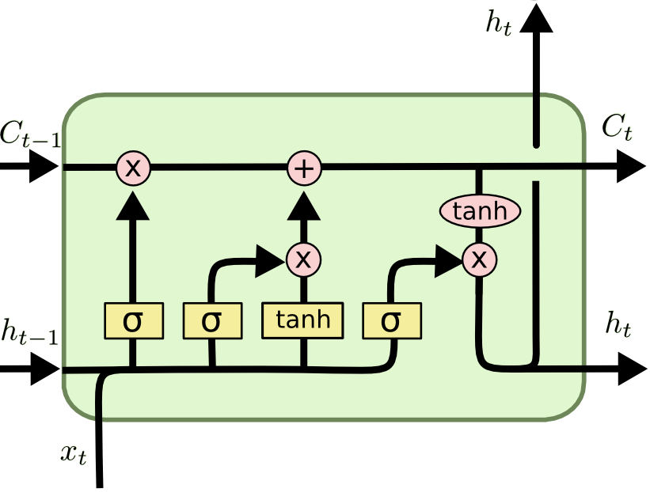

## Financial Time Series Prediction with Deep Learning

> _**Abstract**_. This work presents a study on the application of state-of-art language modeling deep learning architectures to the analysis of financial time series.
>
> First, after a short introduction to the topic, the article reviews the main deep computing-based trading methods in the literature: Recurrent Neural Networks (RNNs; primarily the Long Short-Term Memory, LSTM architecture), Convolutional Neural Networks (CNNs) and related work.
>
> Second, the paper describes the implementation of an LSTM network by gently illustrating the variety of concerns it entails, and gives examples of how this model could be able to provide profitable predictions of cryptocurrencies’ price trends such as Bitcoin.

------

*Challenge Based Innovation, GCiED*

- Alex Carrillo Alza [alex.carrillo.alza@estudiantat.upc.edu]

- *Advisor*: Prof. J. A. Rodríguez [jose.fonollosa@upc.edu]

January 2021, Universitat Politecnica de Catalunya



### Contents

1. **Introduction and Motivation**
2. **Literature**
3. **Method and Model Design**
4. **Methodology and Development**
   1. Dataset and Preprocessing
   2. Details of Implementation
5. **Experiments**
6. **Results**
7. **Conclusions and Future Work**

**References**


### Files

```
.
├── latex
│   ├── LSTM.png
│   ├── Makefile
│   ├── README.txt
│   ├── cvpr.sty
│   ├── cvpr_eso.sty
│   ├── egbib.bib
│   ├── egbib.log
│   ├── egpaper_final.aux
│   ├── egpaper_final.bbl
│   ├── egpaper_final.blg
│   ├── egpaper_final.log
│   ├── egpaper_final.pdf
│   ├── egpaper_final.tex
│   ├── eso-pic.sty
│   └── ieee_fullname.bst
├── references
│   ├── Algorithmic\ Financial\ Trading\ with\ Deep\ CNNs\ -\ Time\ Series\ to\ Image\ Conversion\ Approach.pdf
│   ├── Comparison\ of\ GARCH,\ Neural\ Network\ and\ Support\ Vector\ Machine\ in\ Financial\ Time\ Series\ Prediction.pdf
│   ├── DEEP\ NEURAL\ NETWORKS\ FOR\ CRYPTOCURRENCIES\ PRICE\ PREDICTION.pdf
│   ├── Deep\ LSTM\ with\ Reinforcement\ Learning\ Layer\ for\ Financial\ Trend\ Prediction\ in\ FX\ High\ Frequency\ Trading\ Systems.pdf
│   ├── Deep\ Learning\ for\ Financial\ Applications\ -\ A\ Survey.pdf
│   ├── Deep\ Learning\ for\ Stock\ Market\ Prediction\ Using\ Technical\ Indicators\ and\ Financial\ News\ Articles.pdf
│   ├── LONG\ SHORT-TERM\ MEMORY.pdf
│   ├── On\ the\ difficulty\ of\ training\ Recurrent\ Neural\ Networks.pdf
│   ├── Predicting\ the\ direction\ of\ stock\ market\ prices\ using\ random\ forest.pdf
│   ├── Stock\ Price\ Prediction\ via\ Discovering\ Multi-Frequency\ Trading\ Patterns.pdf
│   ├── Stock\ market's\ price\ movement\ prediction\ with\ LSTM\ neural\ networks.pdf
│   └── THE\ 10\ REASONS\ MOST\ MACHINE\ LEARNING\ FUNDS\ FAIL.pdf
├── stats
│   ├── all_stats.py
│   ├── final_stats.py
│   └── new_stats.py
└── trains
│   ├── all_trains.sh
│   ├── final_trains.sh
│   └── new_trains.sh
├── bars.py
├── commands.txt
├── loader.py
├── model.py
├── PAPER.pdf
├── plots.py
├── README.md
├── save_data.py
├── stats_plots.py
└── test.py
```

